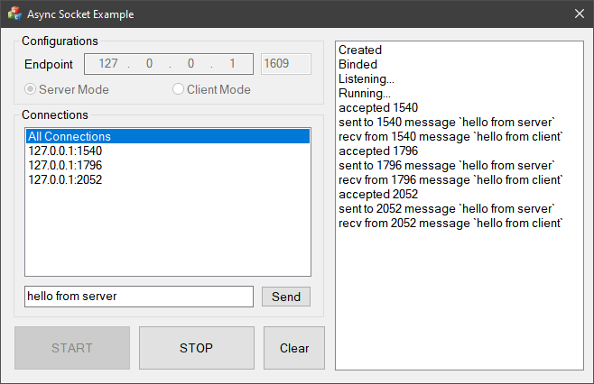
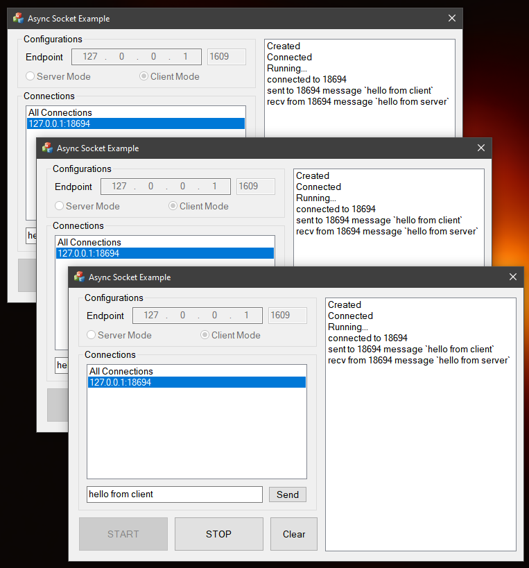

### Async Socket Example ###

This is an example that quickly create `asynchronous socket server/client` by **Vutils Async Socket** in C++

---

#### Installation ####

> Depends on **Async Socket** in [https://github.com/vic4key/Vutils](https://github.com/vic4key/Vutils)

#### Screenshots ####

> Async Socket Server
>
> 

> Async Socket Clients
>
> 

---

Website: https://vic.onl/